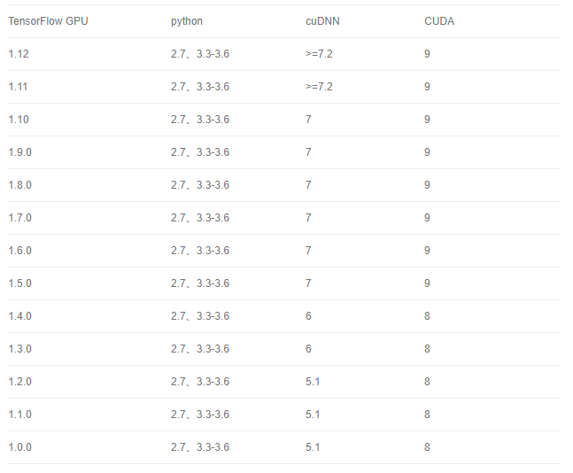
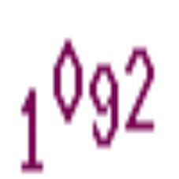

## 基于CNN的验证码图片识别
### 简介
	本项目采用alexnet模型和letnet模型，可根据实际需要选择(在train_model.py中的train函数修改即可)95.5%
### 作者有话说
	不知不觉这个git库伴随我从16到到20年，带给我自己最棒的一段人生旅程，
	整理了这份文档，希望任何想学习图片识别，玩玩卷积神经网络的同学可以最便捷的上手体验。
	请谨慎使用技术，仅支持学习，不支持任何黑灰产相关
	可参看：https://www.urlteam.cn/?p=1893 https://www.urlteam.cn/?p=1406
	原先的Anti-Anti-Spider 全部内容移动到 原Anti-Anti-Spider 目录下
	有何疑问可邮件 543429245@qq.com 咨询

#### Alexnet 模型结构


根据验证码的复杂度不同，训练的时间也会有较大的不同


###  使用方法
	1.开始训练样本前，修改conf/config.json
	2.将预处理过的数据集分成验证集和训练集，放到sample目录下
	3.运行train_model.py开始训练，训练完成的模型保存至model_result中
	4.将训练好的模型放置model_result，运行cnn_models/recognition.py，选定验证码，即可看到模型效果
### 环境配置
TensorFlow CPU版本安装：`pip install tensorflow==1.9.0`
TensorFlow GPU版本安装：`pip install tensorflow-gpu==1.9.0`
GUP版本的安装比较麻烦，需要安装CUDA和cuDNN才能使tensorflow调动GPU
下图为TensorFlow，Python，CUDA与cuDNN之间的版本对应关系：

CUDA与cuDNN安装过程主要有两步：

1. 到官网下载CUDA并安装
2. 将cuDNN解压，复制到CUDA安装目录下
这里提供两个文件的链接：
CUDA：`https://developer.nvidia.com/cuda-toolkit-archive`
cuDNN：`https://developer.nvidia.com/rdp/cudnn-archive`
更具体的安装过程度娘可帮你轻松解决(linux,windows这两步的操作方法各不相同)
### 项目结构
```
├─cnn_models
│  ├─cnn_model.py		# CNN网络类
│  └─recognition.py		# 验证训练结果
├─conf
│  └─config.json		# 配置文件
├─logs			# 模型训练日志
├─model_result	# 模型保存地址
│  └─1040		# 一套训练完成的验证码训练集及对应模型
├─sample
│  ├─test		# 训练集（训练集与验证集一般是对总数据集9:1分割）
│  └─train		# 验证集
├─src			# 配置环境所需的工具，可根据自身情况到网上下载
├─train_model.py		# 训练程序
└─verify_sample.py		# 制作数据集（打标签加图片预处理）
```
### 图片预处理
+ 为验证码图片打上标签，如：

命名为1040_2019-10-13_10_1092.jpg，1092为标签，其余为附加信息，可根据自己需要更改，用`_`分割即可
+ 由于模型输入要求输入必须为227*227，所有需要调整图片形状，verify_sample.py中提供有工具函数
### 注意事项
	alexnet输入必须为227*227的图片，所有图片预处理时可通过PIL中的函数线性转换图片形状，或者缩放后粘贴到227*227的背景中。
