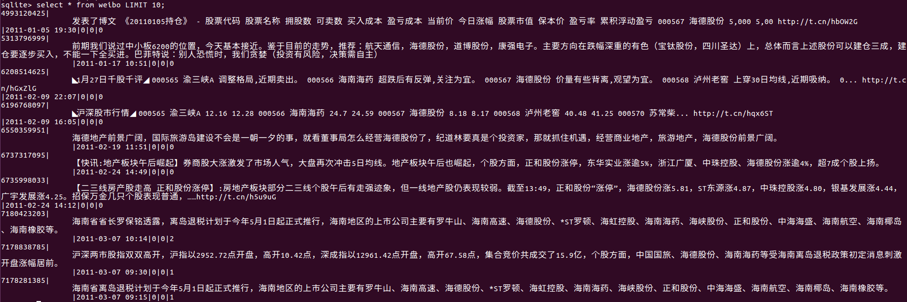

# SinaSpider
动态IP解决新浪的反爬虫机制，快速抓取微博内容。

## Background
抓取1000个公司（在companyList.py文件中）五年内相关的微博，进而统计评论数、转发数、点赞数等等。

## Environment
- Python2.7
- winxp服务器（通过某宝购买，关键是ADSL拨号功能，不然无法实现动态IP，也就解决不了新浪的反爬虫机制）

## Results
- 每个公司五年内的微博（通过sqlite3存储）

  下面截图为company0000.db的微博。

  

- 所有公司微博评论数、转发数、点赞数的统计（excel形式呈现）
  

