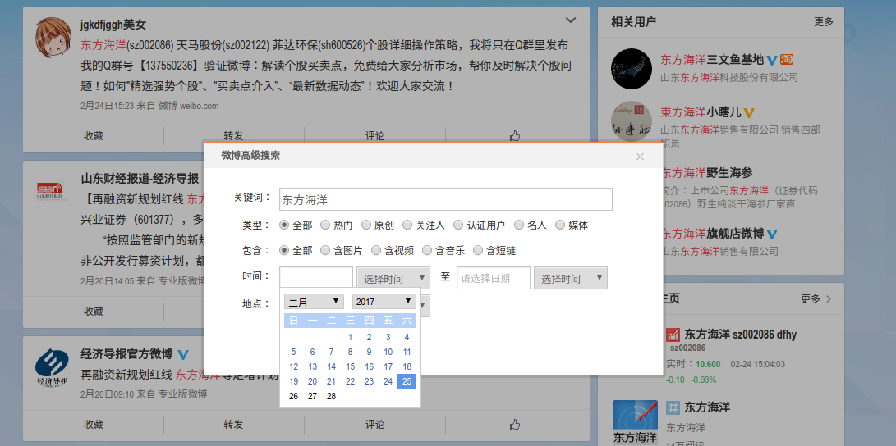
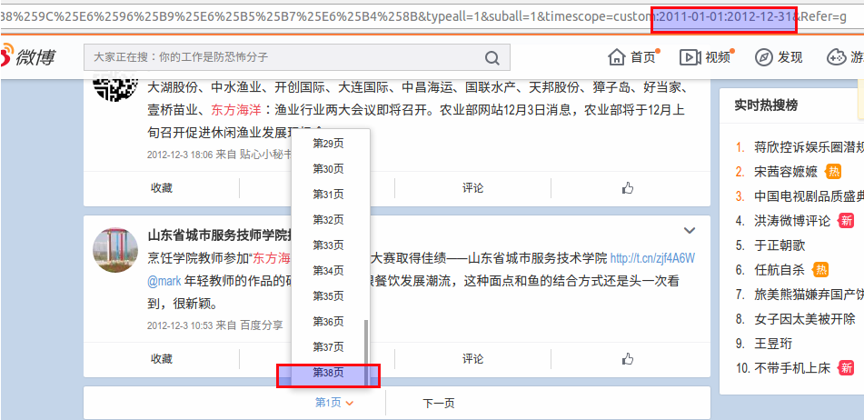
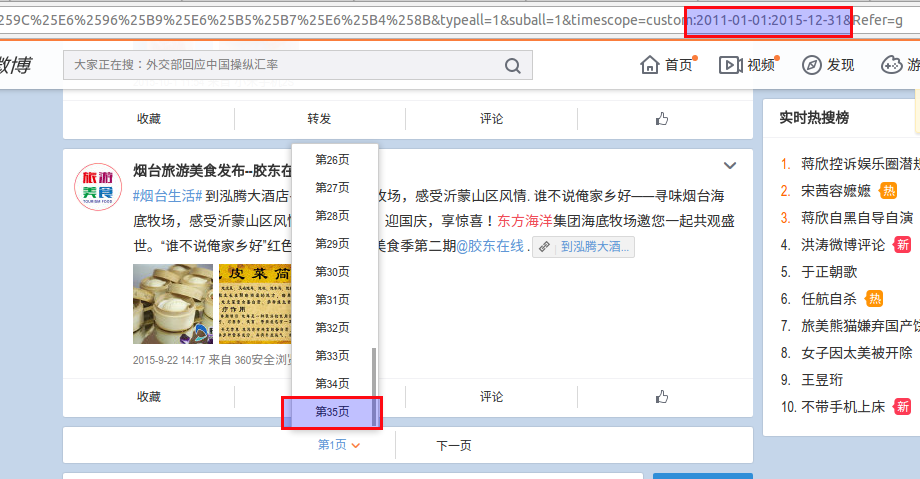
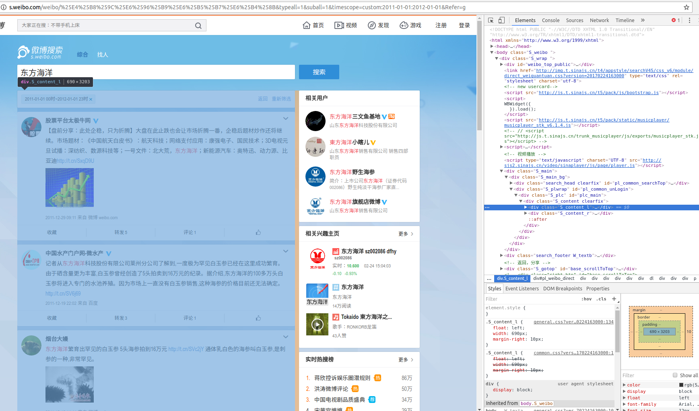
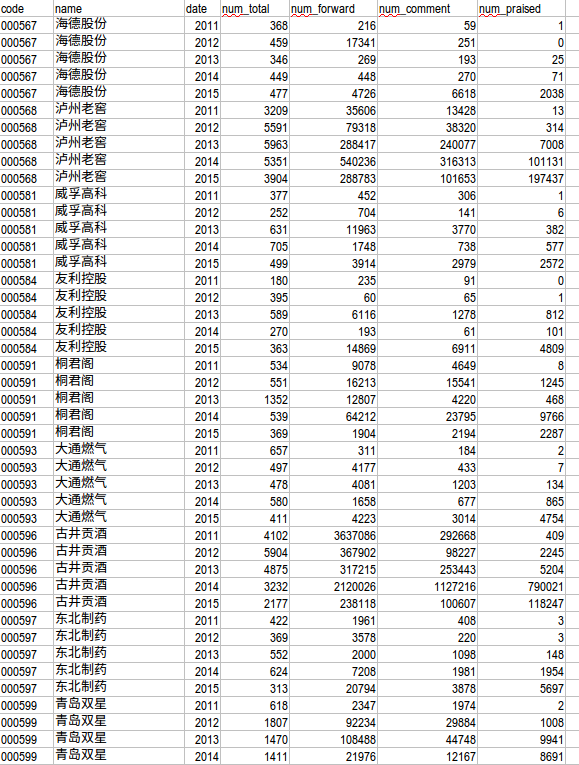

[TOC]

## 项目背景

以公司名称为关键词在[新浪微博](http://s.weibo.com/)中搜索2011-2015五年的所有微博，并统计评论数、转发数、点赞数，需要搜索的公司有1000个左右。

在ADSL拨号上网的计算机上运行Python爬虫程序，并将数据存储到sqlite3数据库中。项目主页为[https://github.com/szcf-weiya/SinaSpider](https://github.com/szcf-weiya/SinaSpider)，其中有完整的爬虫代码。
同步发布在 https://github.com/luyishisi/Anti-Anti-Spider 以及博客：
 https://www.urlteam.org/2017/02/%E4%BB%A5%E5%85%AC%E5%8F%B8%E4%B8%BA%E5%85%B3%E9%94%AE%E8%AF%8D%E7%9A%84%E6%96%B0%E6%B5%AA%E5%BE%AE%E5%8D%9A%E9%87%87%E9%9B%86/
本文将详细阐述具体爬虫实现过程。

## 目标网页

注意到，在未登录状态下是没有高级搜索的，以“东方海洋”公司为例，我们只能得到如下图所示的搜索结果


而我们需要搜索的是特定时间段的微博，发现在登录状态是有高级搜索的，可以设置搜索时间等等，如下图



但搜索结果的显示页面数是有限的，也就是不管微博数目有多少，都只显示特定页数的微博。比如搜索“东方海洋”，如果选择2011.01.01-2012.12.31为搜索区间，则限制页数为38页。



如果选择2011.01.01-2015.12.31为搜索区间，则限制页数为35页。



可见新浪搜索结果的显示条数是有限制的，大致为40个页面（一般每个页面20条微博）。所以如果我们之间设置搜索区间为2011.01.01-2015.12.31，是得不到**所有**微博的。于是我选择的搜索策略是，**每次搜索一天的微博**，这样页面数一般就只有1个页面，就算多一点也不太可能达到限制页面的数量，如果假设**未达到限制页面数的搜索结果，其显示的是所有微博**，则可以认为此时得到的搜索结果就是每天的所有微博。接着对每一天进行搜索就OK了。

但上面的设置搜索时间是在登录状态下实现的，考虑隐私等因素，还是避免使用登录（模拟登录是可以实现的，自己笔记本上运行做过试验了）。于是想直接在非登录态之间访问上面设置时间后的网址，如直接在浏览器中输入网址[http://s.weibo.com/weibo/%25E4%25B8%259C%25E6%2596%25B9%25E6%25B5%25B7%25E6%25B4%258B&typeall=1&suball=1&timescope=custom:2011-01-01:2012-01-01&Refer=g](http://s.weibo.com/weibo/%25E4%25B8%259C%25E6%2596%25B9%25E6%25B5%25B7%25E6%25B4%258B&typeall=1&suball=1&timescope=custom:2011-01-01:2012-01-01&Refer=g)，竟然发现也是可行的，只不过一个缺点是此时只显示1个页面的搜索结果，对于一天的微博量，这已经足够了（登录状态下试验，基本上单天的搜索结果都只有一个页面）。

于是，我们直接在非登录态下进行抓取，这样我们就可以构造需要抓取的目标网页。

```python
import datetime
import urllib

tm_start = datetime.date(2011,1,1)
tm_delta = datetime.timedelta(days=1)
tm_end = datetime.date(2015,12,31)
keyword = '东方海洋'
class SinaCrawl():
  def __init__(self,keyword,tm_start,tm_delta,conn,session):
      self.url = 'http://s.weibo.com/weibo/'
      self.URL = self.url + urllib.quote(keyword) + '&typeall=1&suball=1&timescope=custom:'+str(tm_start)+':'+str(tm_start)+'&Refer=g'
      self.myheader = {'User-Agent':"Mozilla/5.0 (hp-tablet; Linux; hpwOS/3.0.2; U; de-DE) AppleWebKit/534.6 (KHTML, like Gecko) wOSBrowser/234.40.1 Safari/534.6 TouchPad/1.0"}
      self.conn = conn
      self.session = session
```

## 解析网页

利用浏览器的开发者工具，我们首先对网页内容进行分析，找到我们需要抓取内容在源码中的位置。



然而这样会有一个问题，本以为找到了所要抓取内容的位置，但是当使用BeautifulSoup寻找结点时，会发现找不到。原来我们获取得到的网页源码并非如开发者工具中所示，而是如下图所示


注意到图中的红色方框，图中蓝色高亮部分经过一定的处理后是一个JSON，而在开发者工具中显示的元素结构是JSON中'html'对应的值。于是我们首先需要提取该条script，注意到该条script区别于其他script的是含有"pid":"pl_weibo_direct"，利用正则表达式便可以提出该条script。

```python
import requests

def getWeiboContent(self):
    weiboContent = ""
    try:
        req = self.session.get(self.URL, headers = self.myheader)
        if req.status_code == 200:
            print 'This session work.'
        else:
            print 'This session not work with code 200.'
            return False
    except:
        print 'This session not work.'
        return False
    try:
        page = req.content

    except httplib.IncompleteRead:
        print 'Incompleted!'
        return False

    soupPage = BeautifulSoup(page, 'lxml')
    numList = soupPage.find_all('script')
    if len(numList) == 0:
        print 'you may need to input an access code'
        return False
    for i in range(0, len(numList)):
        IsSearch = re.search(r"\"pid\":\"pl_weibo_direct\"", str(numList[i]))
        if IsSearch == None:
            continue
        else:
            weiboContent = str(numList[i])
            break
    return weiboContent

```

提取有意义的script后进行JSON解析，取出'html'的值得到“真正”的微博网页源码weiboHtml。

```python
def getWeiboHtml(self):
    weiboContent = self.getWeiboContent()
    if weiboContent == "":
        print 'WeiboContents are empty. You may need to input an access code.'
        return False
    elif weiboContent == False:
        return False

    # in case some empty json element
    substr = re.compile("\[\]")
    weiboContent = substr.sub("\"NULL\"", weiboContent)

    substr1 = re.compile("^.*STK.pageletM.view\\(")
    substr2 = re.compile("\\)$")
    substr4 = re.compile(r'\[')
    substr5 = re.compile(r'\]')
    substr6 = re.compile(r'\)</script>$')
    weiboContent = substr1.sub("", weiboContent)
    weiboContent = substr2.sub("", weiboContent)
    weiboContent = substr4.sub("", weiboContent)
    weiboContent = substr5.sub("", weiboContent)
    weiboContent = substr6.sub("", weiboContent)
    try:
        weiboJson = json.loads(weiboContent)
    except:
        print 'Json Error!'
        return -3
    if weiboJson == None:
        print 'you may need to input an access code'
        return True
    weiboHtml = weiboJson["html"]
    return weiboHtml

```

然后我们分析weiboHtml，确定所要抓取信息的位置，利用BeautifulSoup提取相应的数据。

首先判断是否无搜索结果

```python
soup = BeautifulSoup(weiboHtml, 'lxml')
Noresult = soup.find_all('div',{'class':'pl_noresult'})
if len(Noresult) != 0:
    print 'NO result for the current search criteria.'
    # No result
    return 0
```

若有搜索结果返回当前页面的每条微博

```python
WeiboItemAll =  soup.find_all('div',{'action-type':'feed_list_item'})
WeiboItemFeed = soup.find_all('ul', {'class':'feed_action_info feed_action_row4'})
WeiboItemContent = soup.find_all('p',{'class':'comment_txt'})
```

WeiboItemAll 为整条微博，它包括WeiboItemContent和WeiboItemFeed


然后将每一条微博转换为soup对象，提取微博内容、点赞数、评论数以及转发数。

```python
for i in range(0, len(WeiboItemContent)):
    soupContent = BeautifulSoup(str(WeiboItemContent[i]), "lxml")
    soupAll = BeautifulSoup(str(WeiboItemAll[i]), "lxml")
    soupFeed = BeautifulSoup(str(WeiboItemFeed[i]), "lxml")

    mid = str(soupAll.div.attrs['mid'])
    STR = ""
    for string in soupContent.strings:
        STR += string
        content = STR
        when = soupAll.find('a',{'class':'W_textb'})
        weibotime = str(when['title'])
        WeiboItemPraised = soupFeed.ul.contents[7]
        WeiboItemComment = soupFeed.ul.contents[5]
        WeiboItemForward = soupFeed.ul.contents[3]
        praisedString = WeiboItemPraised.contents[0].contents[0].contents[1].string
        commentContent = WeiboItemComment.contents[0].contents[0].contents
        forwardString = WeiboItemForward.contents[0].contents[0].contents[1].string

        if praisedString == None:
        	praised = 0
        else:
            praised = int(str(praisedString))
        if len(commentContent) == 1:
            comment = 0
        else:
            comment = int(str(commentContent[1].string))

        if forwardString == None:
            forward = 0
        else:
            forward = int(str(forwardString))
```

## 数据存储
采用sqlite3数据库进行存储数据

```python
import sqlite3
def CreateWeiboTable(db_name):
    conn = sqlite3.connect(db_name)
    try:
        create_tb_sql = '''
        CREATE TABLE IF NOT EXISTS weibo
        (mid TEXT,
        content TEXT,
        time TEXT,
        praised INTEGER,
        comment INTEGER,
        forward INTEGER);
        '''
        conn.execute(create_tb_sql)
    except:
        print 'CREATE table failed'
        return False
    conn.commit()
    conn.close()

dbname = test.db
CreateWeiboTable(dbname)
conn = sqlite3.connect(dbname)
# 抓取得到的微博数据
weiboitem = (mid, content, weibotime, praised, comment, forward)
conn.execute("INSERT INTO weibo VALUES(?,?,?,?,?,?)", weiboitem)
conn.commit()
```

至此，基本的爬虫代码已经完成，但是实际运行会出现一个很严重的问题，便是会在抓取过程中出现验证码。

## 动态IP

因为我们需要不断进行抓取，而抓取次数过高新浪会有IP限制，所以便需要输入验证码（如下）。


经试验，一般连续搜索20次就会要求输入验证码。解决验证码问题是本项目的重点，也是最关键的一步，如果解决了，那按照上面的爬虫进行就好了。为了解决验证码问题，进行了很多尝试。

#### 识别验证码

太天真了，竟然想去识别。这里尝试的是pytesser库，使用其实是很简单的。

```python
from pytesser import *
imgfile = "test.png" # 当前路径中的一个test.png验证码图象
print image_file_to_string(imgfile)
```

如果是下面这种简单的验证码，这种方式的正确率还是蛮高的。


另外，也尝试了PIL库先对验证码进行预处理（均值滤波、中值滤波等等），但效果均不理想，故放弃。

#### 代理IP

网上也有相关的案例，但经试验好多代理IP无法使用，或许也因为没有采用正确的处理方式。


#### 人工输入验证码
迫不得已的方法，竟然花了2个小时完成了一个公司的搜索，但之后也没有继续这样傻傻地人工输入了，权当是尝试了各种方案都不行的放松吧。

#### ADSL拨号上网动态IP
最后采用的方案。首先得有一个ADSL拨号上网的计算机，可以在淘宝上购买ADSL拨号上网的winxp服务器，得到宽带上网账号USERNAME及其密码PASSWORD，设置宽带名称为NAME，则可以通过下列Python代码断开网络连接与拨号重连

```python
os.popen('rasdial /disconnect').read()
os.popen('rasdial NAME USERNAME PASSWORD').read()
```

实际操作中，设置抓取15次（经试验，新浪微博一般抓取20次左右要求输入验证码）后断开网络连接，然后重连，实现更换IP的效果，也就避免了输出验证码。

## 运行环境

- Python2.7
- winxp服务器（通过某宝购买，关键是ADSL拨号功能，不然无法实现动态IP，也就解决不了新浪的反爬虫机制）


## 结果

- 每个公司五年内的微博（通过sqlite3存储）存到一个对应的.db文件中，下面截图为company0000.db的微博。
  

- 所有公司微博评论数、转发数、点赞数的统计（直接使用sql查询语句进行统计）

  比如统计每年总微博数

```python
time_sql = [('2011-01-01 00:00', '2011-12-31 23:59'),
            ('2012-01-01 00:00', '2012-12-31 23:59'),
            ('2013-01-01 00:00', '2013-12-31 23:59'),
            ('2014-01-01 00:00', '2014-12-31 23:59'),
            ('2015-01-01 00:00', '2015-12-31 23:59')]

num_total_sql = "select count(*) from weibo where datetime(time) >= datetime('%s') and datetime(time) <=datetime('%s');" %(time_sql[i][0], time_sql[i][1])

res = str(conn.execute(num_total_sql).fetchone()[0]
```
最后将结果写进excel文件中，部分结果如下图所示
  
